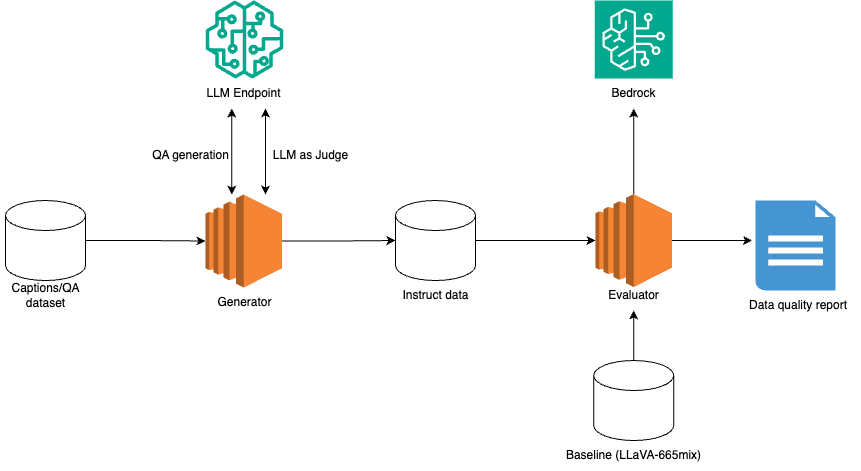

## Generate instruct data for training a LVM model

As the open source LLaVA or other LMM model use the closed source dataset or GPT-generated dataset, the pretrained model is not for commercial use. To accelerate LVM application in industry, we use open source model to generate instruct data and train a LVM which can be used for commercial use.

Our contributions are beflow:
- Build scripts to generate instruct data with Mixtral 8x7B
- Optimize prompt engineering
- Evaluate the quality of Mixtral-generated instruct data with Cluade-2.1

### Architecture
Our data generation system is beflow. First we generate conversations on the existing caption dataset with Mixtral 8x7B, then take Mixtral 8x7B as Judge to judge the generated result and rate it. In the script, we only choose the QA pair with high rating by setting a threshold. We also use Cluade2.1 to evaluate the data quality of the generated instruct dataset by comparing the baseline which is `llava_v1_5_mix665k.json` generated with GPT4.

    <figcaption>LLM-based instruct dataset generation</figcaption>

### Prerequisites
- Add `ssh pub key` to Hugginface account for downloading dataset from huggingface hub.
- `ml.g5.x48large` SageMaker endpoint instance

### Dataset
In this project, we need the following dataset:
- COCO2017
- VQA
- GQA

To compare the quality of our generated instruct dataset with GPT4-generated instruct dataset, we also need `llava_v1_5_mix665k.json` which is created in [LLaVA](https://github.com/haotian-liu/LLaVA/tree/main)

In terminal, go to `dataset` and run `bash prepare_dataset.sh`.

### Experiments
To conduct experiment on few samples, run `gen_data_llm.ipynb` to walk through all steps from creating an Mixtral 8x7B endpoint to generating the instruct data aligned with `llava_v1_5_mix665k.json`. For further analysis, run `dataset_analyze.ipynb` to compare Mixtral-generated instruct data and GPT4-generated instruct data.

### Run data generation on all dataset
We only use the images existing in `llava_v1_5_mix665k.json` so that we can compare our generated dataset with `llava_v1_5_mix665k.json` generated with GPT4, and also for further model performance comparison. For COCO dataset, 88K images (totally 118K) are the targeted items.

The duration for each sample is about 1 minute. With single processor, it will take about 61-days on `COCO2017`. Therefore we use multi-thread to do generateion in parallel with multiple endpoints. To make the query on each worker in multi-thread processed by LLM endpoint immediately, we need to deploy the endpoint on multiple instances by setting `initial_instance_count`, and in `generate_instruct_data.py`, we set the number of workers with the number of endpoints.